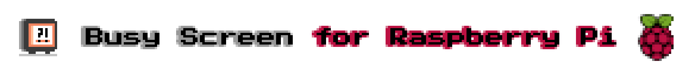

# Busy Screen

Turns your Raspberry Pi into a status screen to show your colleagues, family, friends, or whoever might disturb you if you're busy or not.

```shell
PUT http://192.168.168.168:1880/status
Content-Type: application/json; charset=utf-8

{
  "name": "making frontend responsive",
  "task": "TICKET-123",
  "duration": "PT50M",
}
```

**Set status to "making frontend responsive" with an estimation of 50 minutes**

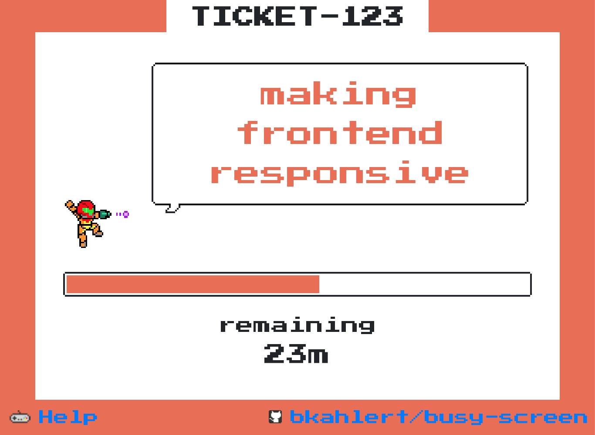  
**Being busy with state "making frontend responsive" for 23 minutes**

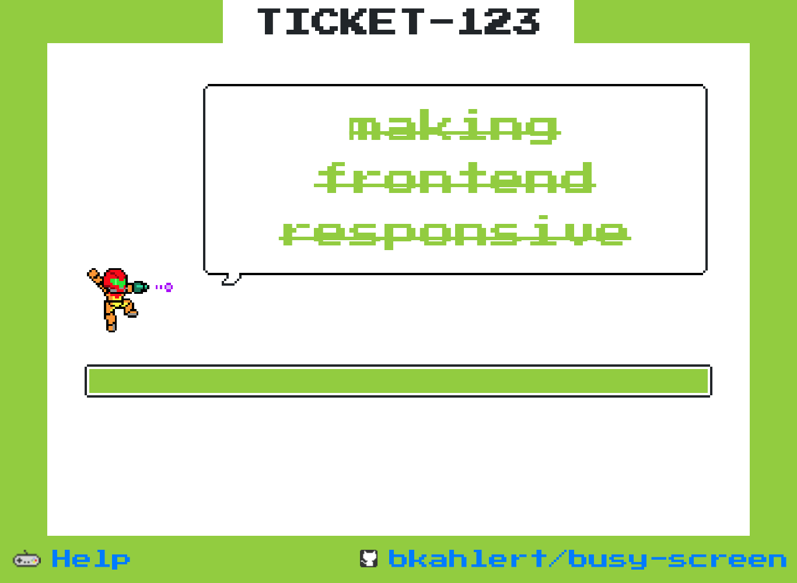  
**No more being busy**

## Installation

This application consists of a backend implemented as a [Node RED flow](kustomize/home/busy-screen/flows.json) and a frontend implemented with Kotlin JS.

Consequently, you'll need a Node RED installation and a webserver to provide access to the frontend.

### Install on a Raspberry Pi

The Raspberry Pi is the recommended way to run Busy Screen which has been successfully tested on a:

- Raspberry Pi 1 Model B+
- Raspberry Pi Zero / W / WH
- Raspberry Pi 4

The installation consists of the following steps:

1) Create an `.env` file at `kustomize/.env` like the following one:
   ```dotenv
   BUSY_SCREEN__WPA_SUPPLICANT="""ctrl_interface=DIR=/var/run/wpa_supplicant GROUP=netdev
   update_config=1
   country=DE
   
   network={
   ssid="My WiFi name"
   psk="My WiFi password"
   }
   """
   BUSY_SCREEN__PRETTY_NAME="My Busy Screen"
   BUSY_SCREEN__USERNAME="my-username"
   BUSY_SCREEN__PASSWORD="my-password"
   BUSY_SCREEN__AUTHORIZED_KEY="ssh-rsa ..."
   ```
2) Create an image using `./busy-screen.build.sh`  
   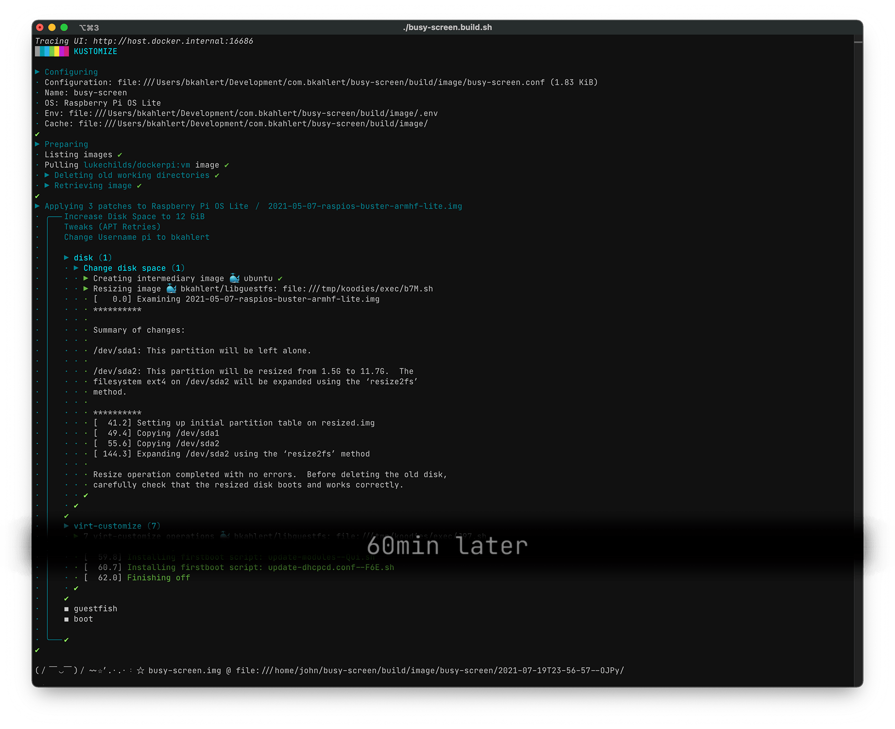
3) Flash your memory card with the just created image
4) Boot your Raspberry Pi with the memory card

After 1-2 automatic reboots the loading screen shows up.
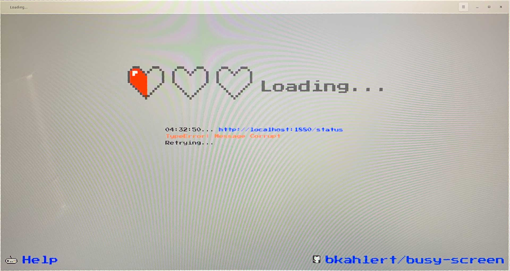

A few moments later the backend can receive status updates, like this one:

```shell
curl -X PUT --location "http://192.168.168.168:1880/status" \
     -H "Content-Type: application/json; charset=utf-8" \
     -d "{
           \"name\": \"finishing soon\",
           \"duration\": \"PT2M\"
         }"
```

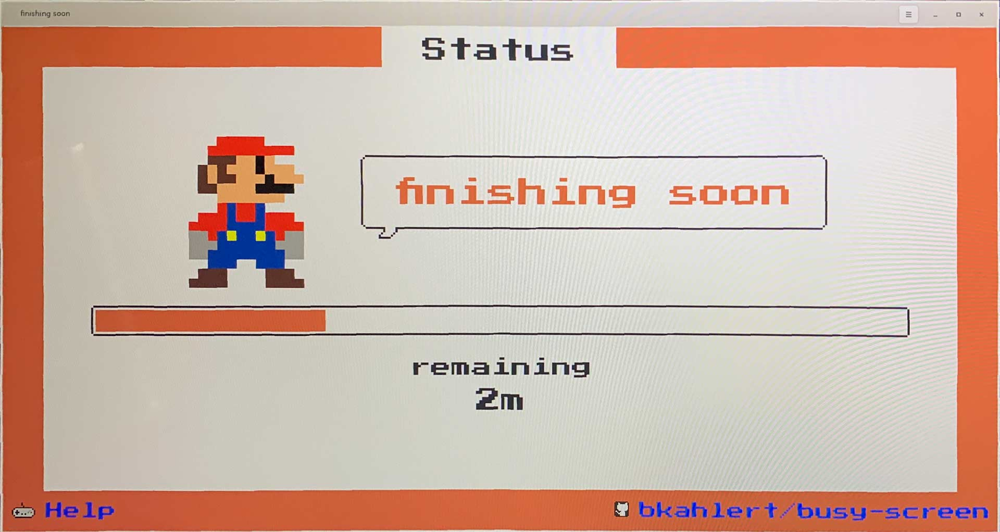

The following properties are supported:

```json
{
  "name": "status name that is displayed in the speech bubble",
  "task": "task title used as the headline on the top border",
  "duration": "60000",
  "email": "john.joe@example.com",
  "on": {
    "finish": {
      "method": "post",
      "url": "http://my-talking-robot/say",
      "payload": "finished working"
    }
  }
}
```

The only required field is `name`. All other fields are optional.

The `duration` can be specified in

- number of milliseconds (`60000`ms = 1min) or
- in [ISO8601](https://en.wikipedia.org/wiki/ISO_8601) format (`PT1M` / `PT60S` = 1min)

You can find further examples in [http-client.http](http-client.http).

#### Connectivity

You can either connect to your device via:

- Ethernet: **IP can be found on the screen**
    - Just plug in a cable.
- Wifi: **IP can be found on the screen**
    - You can provide the corresponding WPA supplicant file with [busy-screen.conf](kustomize/busy-screen.conf).
- USB: **IP `10.10.10.10`**
    - [busy-screen.conf](kustomize/busy-screen.conf) configures the Raspberry Pi to provide ethernet access via USB.
    - Ideally that includes configuring your computer with DHCP. If that doesn't work, please configure the network device `Busy Screen` with
      IP `10.10.10.11/29` (`255.255.255.248`).
- Bluetooth: **IP `10.10.10.20`**
  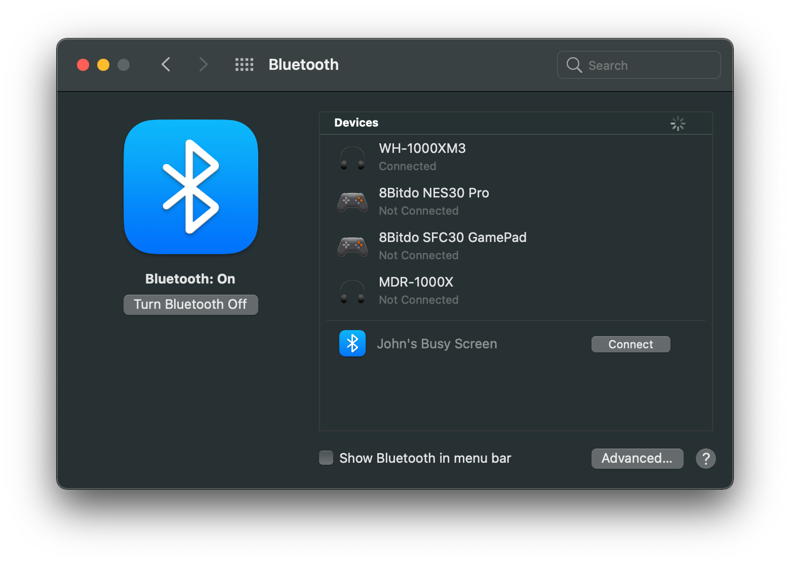
  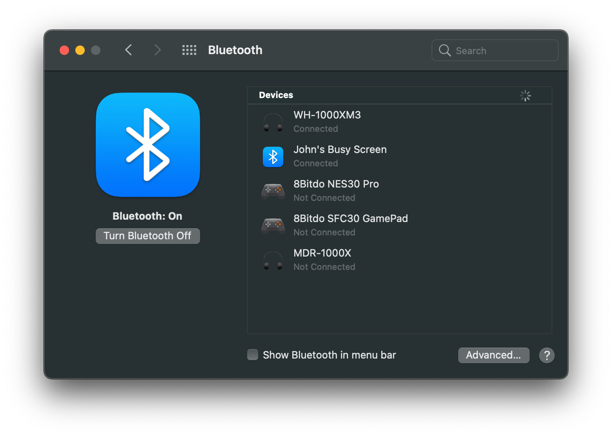
    - [busy-screen.conf](kustomize/busy-screen.conf) configures the Raspberry Pi to provide ethernet access via Bluetooth PAN.
    - Ideally that includes configuring your computer with DHCP. If that doesn't work, please configure the network device `Busy Screen` with
      IP `10.10.10.21/29` (`255.255.255.248`).

#### Discovery

If you start your device with a connected screen, you see the following information that help you finding your device:

- Your device **name** is written on the left border.
- Your device **IP** is written on the right border.
- Your **username** is written below the avatar.
- **Nearby devices** are listed in a dropdown that opens when you click your username.
    - The device currently connected to is always on top.
    - Using the "Switch" button you can connect to the selected device.

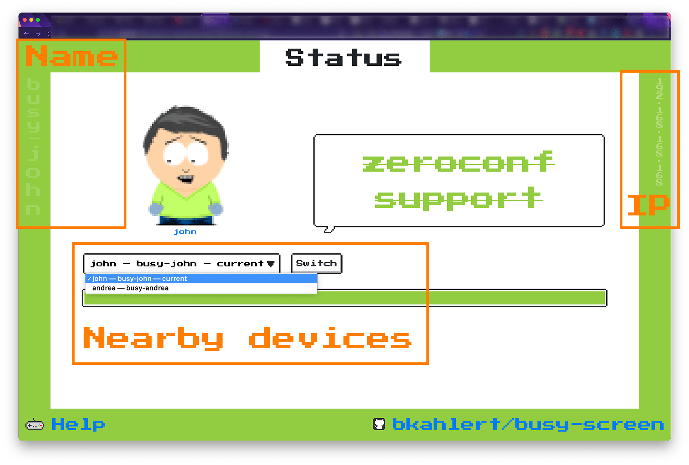

Avahi is installed on your Raspberry Pi with all relevant services advertised in your network. You can use any zeroconf / mDNS / Bonjour client to discover your
device.

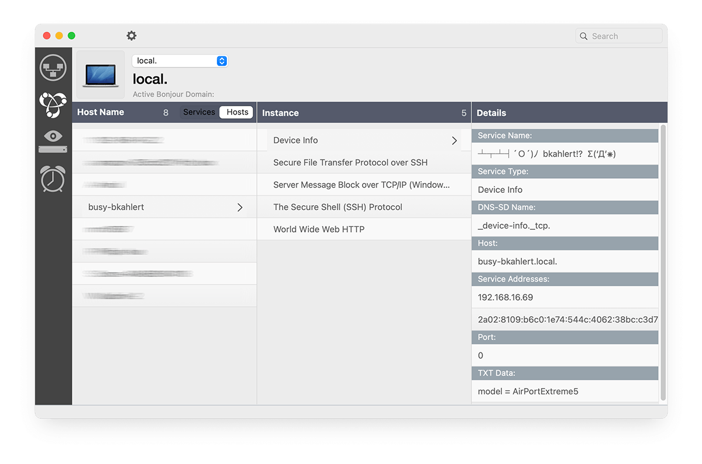

Alternatively you can log in to your router and find out what new devices received a dynamic IP address from it.

### Install Manually / Locally

The manual installation consists of the following steps:

1) [Install Node RED](https://nodered.org/docs/getting-started/)
2) Import [busy-screen.flow](kustomize/home/busy-screen/flows.json) to Node RED
3) Build the frontend with `./gradlew build -x test`
4) Set up an HTTP server to publish the [just built frontend](build/distributions), e.g. using `npx http-server -c -p 80`
5) open the published frontend  
   (automatically opened if you use the `npx` command above)
6) change the `address` query parameter in the URL to the one of your Node RED installation

## Customization

Busy Screen can be customized / extended in three ways:

1) The frontend is located at [src/main/kotlin](src/main/kotlin). You can make any changes you like to it and run the [installation](#installation) afterwards.
2) The Node RED flow can be freely changed as you like. In order to customize it, just edit it inside of Node RED. If you followed
   the [installation](#installation) steps above, you already have a running installation.
3) You can customize the way your Raspberry Pi image is created. The image creation is done with the image customization
   tool [Kustomize](https://github.com/bkahlert/kustomize). The actual configuration is stored in [busy-screen.conf](kustomize/busy-screen.conf).

## Responsive Design

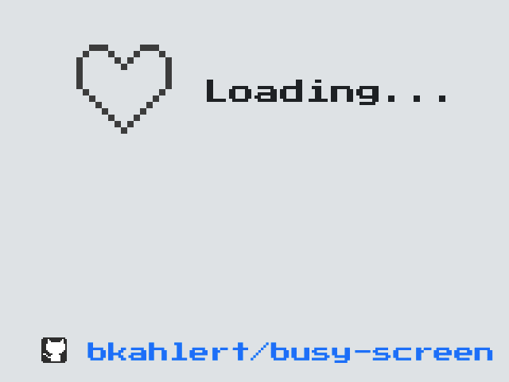  
**Loading screen on small device**

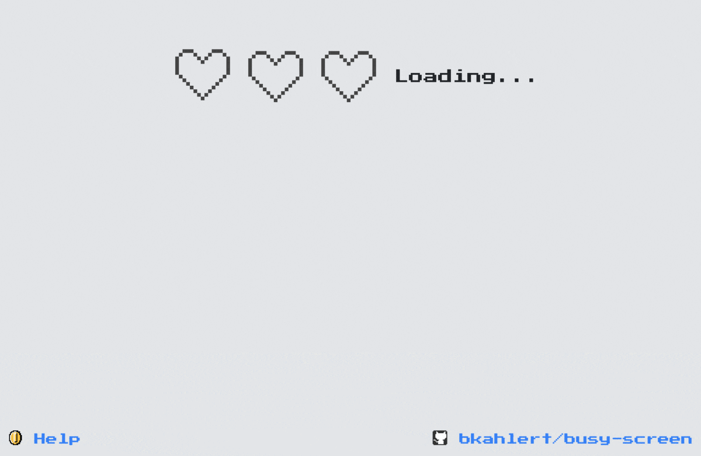  
**Loading screen on large device**

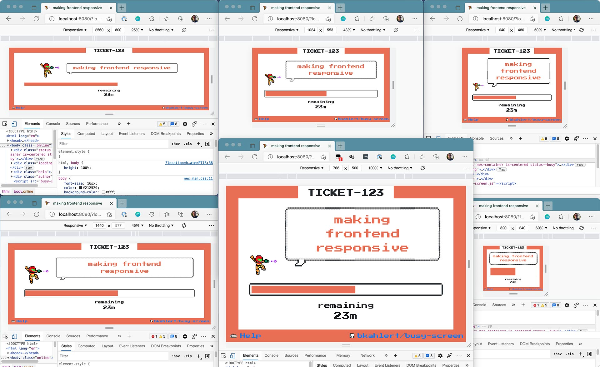  
**Responsive previews with busy state**

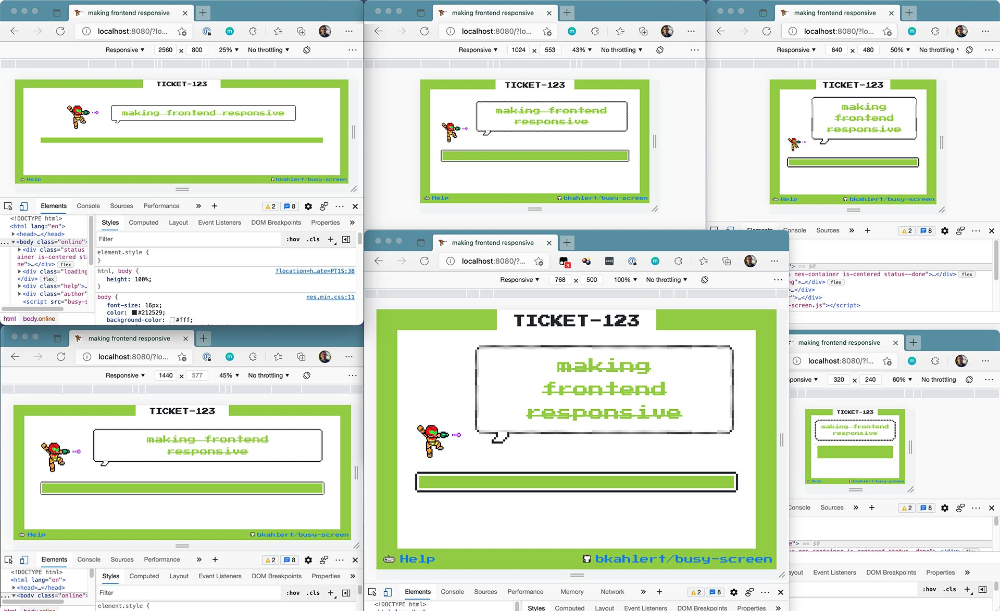  
**Responsive previews with done state**

## Debugging

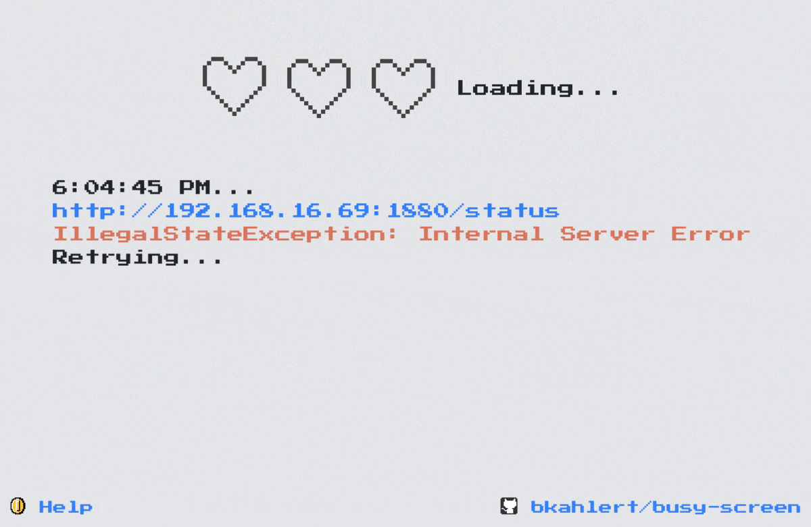  
**Loading screen with error message**

## Known Issues / TODO

- [ ] on Raspberry Pi B+ the Plymouth based loading screen only works  
  after `raspi-config` → Advanced Options → G1 Fake KMS was selected.

- [ ] get network connection to Raspberry Pi booted with dockerpi
    - [ ] check for SSH
    - [ ] check for HTTP
    - [ ] change status and check if page changed

## Copyright

Nintendo owns the copyright to Mario, Samus, the heart container, the coin and the controller. Please comply with the Nintendo guidelines and laws of the
applicable jurisdiction.

South Park characters have been designed with the amazing [SP-Studio](https://www.sp-studio.de/).

## References

- [Adventures with SPI TFT screens for the Raspberry Pi](https://www.willprice.dev/2017/09/16/adventures-with-tft-screens-for-raspberry-pi.html)
- [SPI TFT LCD](https://blog.gc2.at/post/spi-tft-lcd2/)
