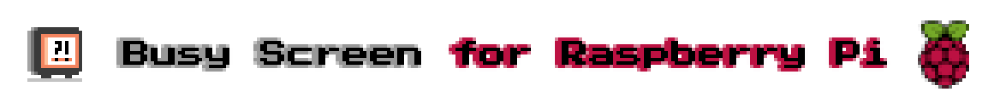

# Busy Screen [](https://github.com/bkahlert/busy-screen/actions/workflows/ci.yml) [](https://github.com/bkahlert/busy-screen/blob/main/LICENSE) [](https://www.buymeacoffee.com/bkahlert)

Turns your Raspberry Pi into a status screen to show your colleagues, family, friends, or whoever might disturb you if you're busy or not.

```shell
PUT http://192.168.168.168:1880/status
Content-Type: application/json; charset=utf-8

{
  "name": "making frontend responsive",
  "task": "TICKET-123",
  "duration": "PT50M",
}
```

**Set status to "making frontend responsive" with an estimation of 50 minutes**

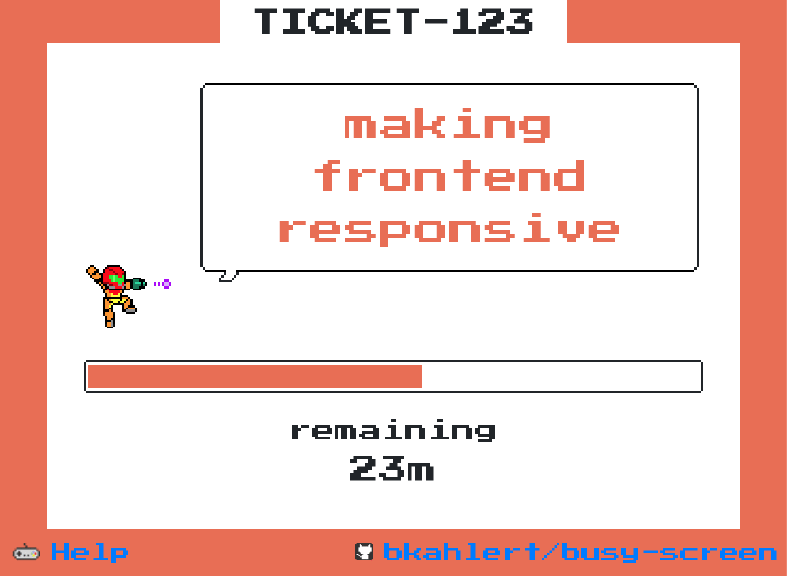  
**Being busy with state "making frontend responsive" for 23 minutes**

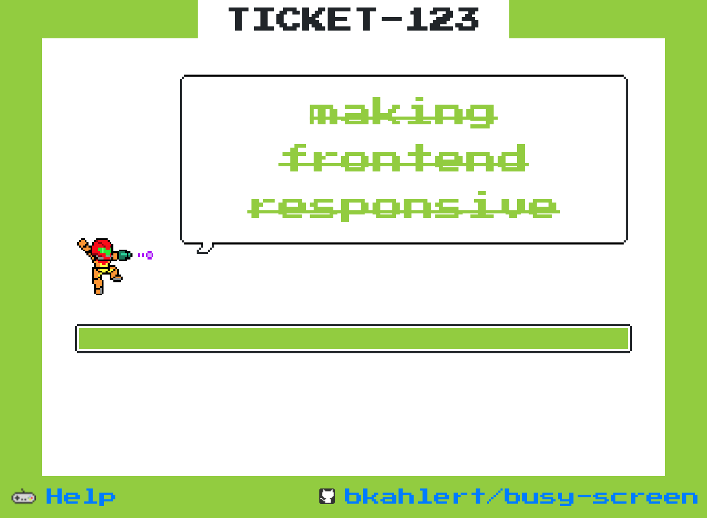  
**No more being busy**

## Install on a Raspberry Pi

Busy Screen runs on [Pi Hero 2](https://github.com/bkahlert/pihero): copy [devices/sample/user-data](devices/sample/user-data),
set the hostname and your SSH key, flash a card with pihero's `make flash`, and the board installs `busy-screen-server` (Node-RED
with the Busy Screen flow, port 1880) and `busy-screen-display` (the web display behind lighttpd, shown full screen by
`pihero-kiosk`). [devices/README.md](devices/README.md) has the details, including the lines for the Waveshare 3.5-inch LCD and
what to change for an HDMI display. Any browser on the LAN shows the same page at `http://<host>.local/`. Updates are
`sudo apt upgrade`. Pi Hero 1's Ansible installer is frozen at the tag
[`busy-screen-ansible`](https://github.com/bkahlert/busy-screen/tree/busy-screen-ansible).

When the installation is complete, the loading screen shows up.
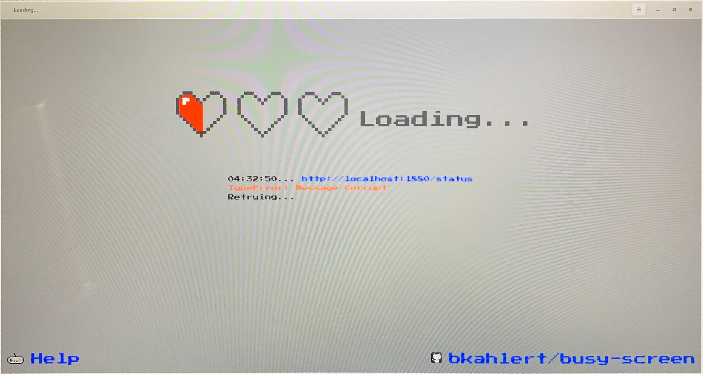

A few moments later the backend can receive status updates, like this one:

```shell
curl -X PUT --location "http://busy-screen.local:1880/status" \
     -H "Content-Type: application/json; charset=utf-8" \
     -d "{
           \"name\": \"finishing soon\",
           \"duration\": \"PT2M\"
         }"
```

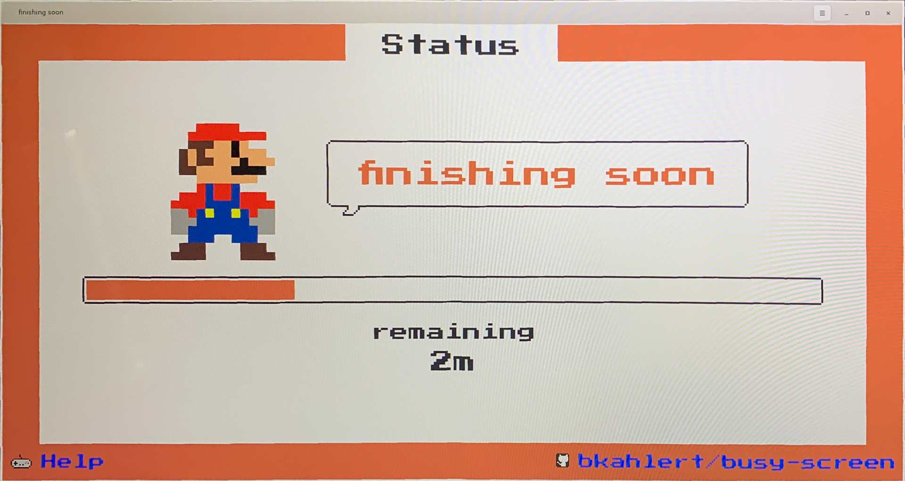

The following properties are supported:

```json
{
    "name": "status name that is displayed in the speech bubble",
    "task": "task title used as the headline on the top border",
    "duration": "60000",
    "email": "john.joe@example.com",
    "on": {
        "finish": {
            "method": "post",
            "url": "http://my-talking-robot/say",
            "payload": "finished working"
        }
    }
}
```

The only required field is `name`. All other fields are optional.

The `duration` can be specified in

- number of milliseconds (`60000`ms = 1min) or
- in [ISO8601](https://en.wikipedia.org/wiki/ISO_8601) format (`PT1M` / `PT60S` = 1min)

You can find further examples in [http-client.http](http-client.http).

### Discovery

If you start your device with a connected screen, you see the following information that help you finding your device:

- Your device **name** is written on the left border.
- Your device **IP** is written on the right border.

`pihero-avahi` advertises the device and its services in your network, so any zeroconf / mDNS / Bonjour client finds it, as does
`http://<host>.local/`.

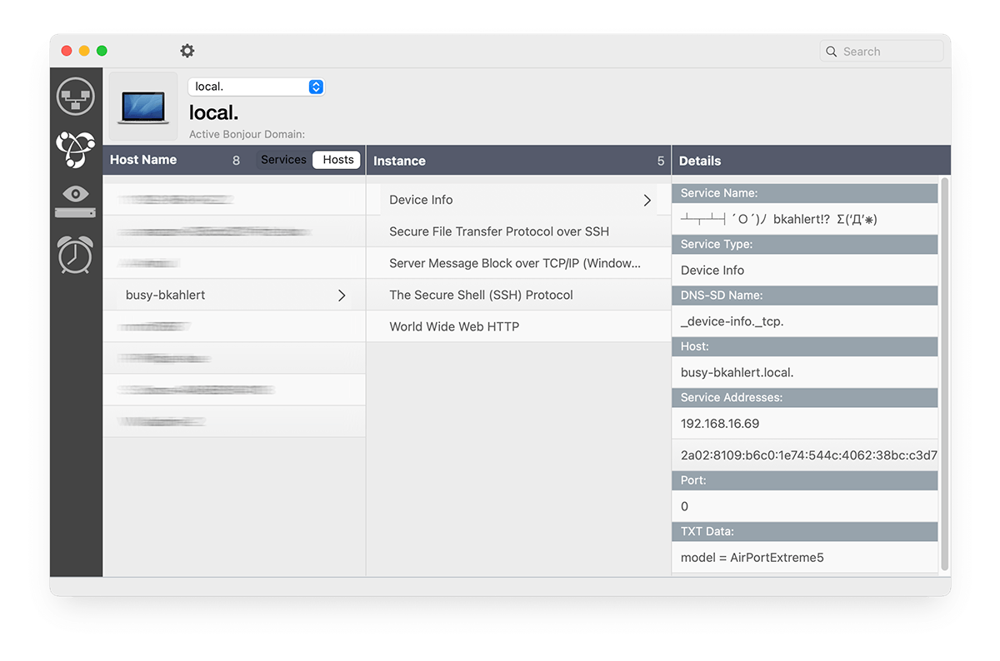

### Run it anywhere

The backend is a [Node-RED flow](packages/busy-screen-server/flows.json), the frontend a Kotlin/JS bundle:

1) [Install Node-RED](https://nodered.org/docs/getting-started/) and `node-red-contrib-ip`, import the flow, and give
   `functionGlobalContext` a `moment` (see [settings.js](packages/busy-screen-server/server/settings.js))
2) Build the frontend with `./gradlew jsBrowserDistribution`; Gradle picks a JDK 17 from the installed ones, as
   [gradle/gradle-daemon-jvm.properties](gradle/gradle-daemon-jvm.properties) asks
3) Serve [build/dist/js/productionExecutable](build/dist/js/productionExecutable) with any web server, e.g. `npx http-server -c -p 80`
4) Open the page; it talks to port 1880 of the host it was loaded from. `?address=http://other-host:1880` points it elsewhere.

### Preview the page

Three make targets show the page while you edit it. They read it from Gradle's dev server on port 8082 (netmon uses 8081, so
both can preview side by side) and run a local copy of the backend next to it. The fake needs `node` and the vendored Node-RED.

```shell
make npm              # once: vendor Node-RED for the fake backend
make preview-browser  # the page in a browser tab
```

The targets differ in where the page is shown:

| Target                                           | Shows the page in                                                                       |
|--------------------------------------------------|-----------------------------------------------------------------------------------------|
| `make preview-browser`                           | Any browser: the fastest, with that browser's rendering and its own developer tools     |
| `make preview-vm` (also `make preview`)          | The kiosk's own WPE WebKit, 480×320, in a QEMU window: exact rendering, the Mac's speed |
| `make preview-board TARGET=pi@busy-screen.local` | The kiosk of a real Pi: the panel's own CPU use, the slowest                            |

`preview-vm` and `preview-board` also open the kiosk's Web Inspector. Their variables:

| Variable  | Default | Meaning                                                                                                          |
|-----------|---------|------------------------------------------------------------------------------------------------------------------|
| `BACKEND` | `fake`  | `fake`, `board` or `HOST:PORT`, as listed below                                                                  |
| `STATUS`  | see below | The status the fake starts with, as the JSON that `PUT /status` takes                                          |
| `INSPECT` | `Safari` | The application that opens once the session is up: the page for `preview-browser`, the kiosk's Web Inspector for the others. `INSPECT=0` opens nothing; `INSPECT="Google Chrome"` picks another browser |
| `TARGET`  |         | `preview-board` only, and required there: `user@host[:port]` of the Pi, which needs Pi Hero's `pihero-kiosk` and ssh access without a prompt |

- `BACKEND=fake`: Node-RED with the repository's flow on port 1880 of the Mac, started and stopped by the command.
- `BACKEND=board`: the Pi's own Node-RED (`preview-board` only).
- `BACKEND=HOST:PORT`: a backend that already runs; nothing is started, and `localhost` is the Mac.

`STATUS` defaults to `{"name":"preview","task":"busy-screen on the Mac","duration":"PT10M"}`. The wiring is in
[tests/preview.py](tests/preview.py) and [tests/preview_backend.py](tests/preview_backend.py).

While a preview runs, change the status it shows with the requests in [http-client.http](http-client.http) (environment
`Localhost`) or with `curl`:

```shell
curl -X PUT http://localhost:1880/status -H 'Content-Type: application/json' \
  -d '{"name":"in a call","task":"back at 3","duration":"PT5M"}'
```

#### In the IDE

The run configurations in [.run](.run) start `backend`, `preview-browser`, `preview-vm` and `preview-board` (set its `TARGET`).
To run the dev server from the IDE instead, start the fake first with `make backend` or the run configuration `backend`, then
`busy-screen-web-display [jsBrowserDevelopmentRun --continuous]`. The page finds the fake on port 1880 of its own host.

#### Stopping

Ctrl-C in the terminal ends a preview and everything it started. Only one preview runs at a time, and Gradle allows one build
per project directory, so stop it before `make test-js` or any other `./gradlew`.

From another shell, send SIGINT to the `owner` pid in `dist/preview/session.json`. Do not use `pkill -f` on `preview.py` or
`qemu-system`: it also ends netmon's preview.

#### The VM and the board

The first `make preview-vm` builds a base disk (about 2.5 minutes, cached under `~/.cache/pihero/preview`); later ones start
faster. It needs QEMU, Podman and Accessibility permission for your terminal (to size the window).

`make preview-board` changes nothing lasting on the Pi. One `ssh` connection carries the page, the fake backend and the
inspector between the Mac and the Pi. The kiosk reads its session settings from a drop-in under `/run`, which Ctrl-C removes
and a reboot wipes.

The page is the development bundle, so its CPU and memory use is higher than what `make deploy` installs. On a Model B,
compare flavors and edits with each other, not with production.

### Build and test the packages

```shell
uv sync --frozen                                    # the test harness, once
make build                                          # Gradle and npm, then nfpm: dist/*.deb
make test                                           # JS unit tests, tier 0 (static checks) and tier 1 (install into a systemd container)
make test-tier2                                     # tier 2: boot a QEMU VM from devices/sample and show the page in WebKit
make test-preview                                   # the preview's Node-RED fake (needs node, make npm)
make deploy TARGET=pi@busy-screen.local             # the built packages onto a device, no repository involved
```

The harness is [pihero-testkit](https://github.com/bkahlert/pihero/tree/main/testkit); `uv run pytest -m installed --target=ssh
--target-uri=pi@busy-screen.local` checks a running device against the installed tests, and `-m boot` in its place runs the boot
and display tests against the device, leaving `dist/ssh/display.png`. A release is `make release VERSION=X.Y.Z` and
`git push origin vX.Y.Z`; the workflow builds, signs and publishes the repository.

Tier 2 needs QEMU (`brew install qemu`) and Playwright's WebKit (`make browser`, downloaded once into Playwright's cache). It
boots the real Raspberry Pi OS root filesystem with [devices/sample/user-data](devices/sample/user-data), rendered for the VM by
[tests/vm_device.py](tests/vm_device.py), checks that the provisioning posted its "setting up" status, and loads the page in
WebKit at the panel's 480×320; the run leaves `dist/tier2/display.png`. The VM has a virtual display of that size
(`VM_DISPLAY=480x320`), so `pihero-kiosk` runs cog on it as on the board; the run checks that the kiosk has not restarted and
leaves QEMU's picture of it as `dist/tier2/kiosk.png`. `make vm` keeps the VM running for a look around, and `make display URL=…`
opens any page, the VM's, the board's or a dev server's, in Playwright's WebKit at that size. `make release` runs tiers 0 to 2;
CI runs tier 2 weekly under software emulation ([weekly.yml](.github/workflows/weekly.yml)), since GitHub's runners have no
hardware virtualization.

## Customization

Busy Screen can be customized / extended in two ways:

1) The frontend is located at [src/jsMain/kotlin](src/jsMain/kotlin). You can make any changes you like to it and rebuild
   `busy-screen-display` (`make build`).
2) The Node-RED flow can be freely changed as you like: the editor is at `http://<host>.local:1880/`. On a device the flow runs
   from `/var/lib/busy-screen/flows.json`, which the editor saves to and package upgrades leave alone; delete the file to get the
   shipped flow back on the next start. The palette is fixed to what the package vendors.

## Responsive Design

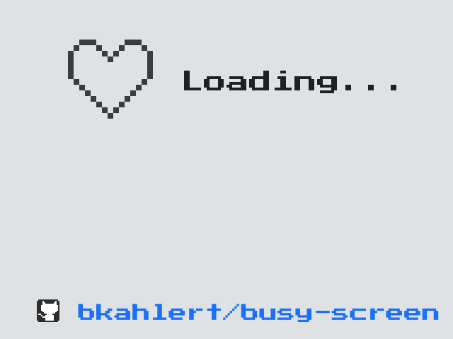  
**Loading screen on small device**

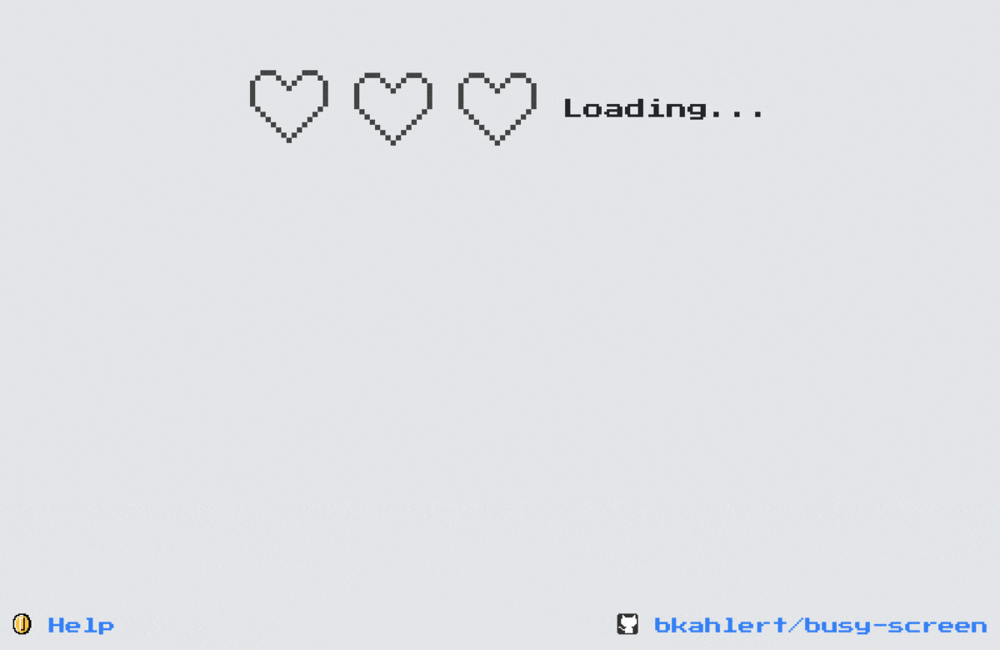  
**Loading screen on large device**

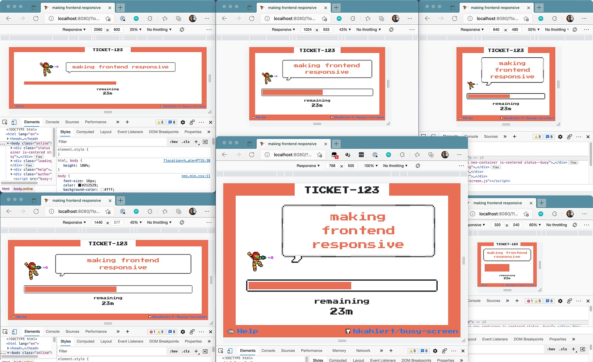  
**Responsive previews with busy state**

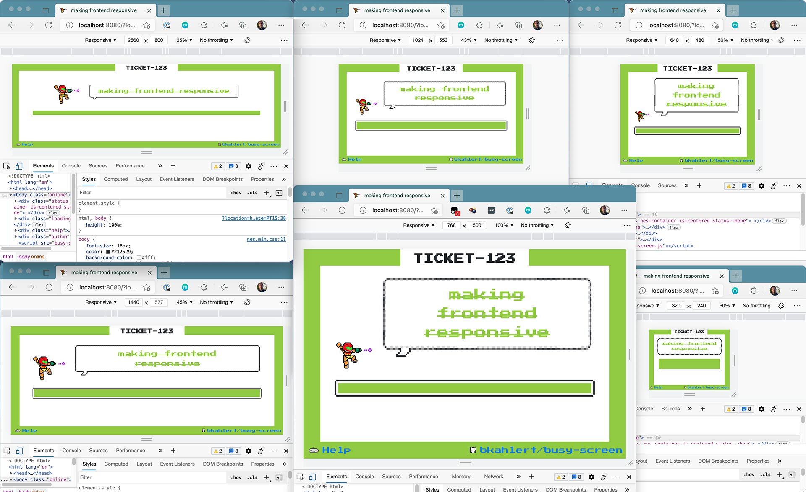  
**Responsive previews with done state**

## Debugging

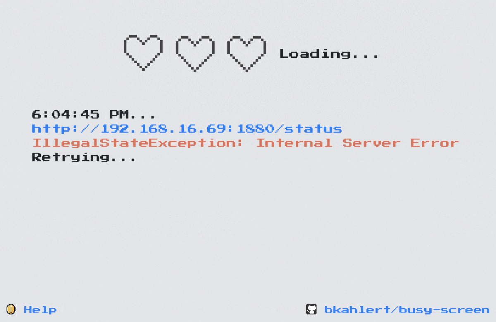  
**Loading screen with error message**

## Copyright

Nintendo owns the copyright to Mario, Samus, the heart container, the coin and the controller. Please comply with the Nintendo guidelines and laws of the
applicable jurisdiction.

South Park characters have been designed with the amazing [SP-Studio](https://www.sp-studio.de/).

## References

- [Adventures with SPI TFT screens for the Raspberry Pi](https://www.willprice.dev/2017/09/16/adventures-with-tft-screens-for-raspberry-pi.html)
- [SPI TFT LCD](https://blog.gc2.at/post/spi-tft-lcd2/)
- [Ilitek ILI9486 DRM driver](https://github.com/torvalds/linux/blob/master/drivers/gpu/drm/tiny/ili9486.c), what the `piscreen,drm` overlay loads for the Waveshare 3.5-inch LCD (A)

## Contributing

Want to contribute? Awesome! The most basic way to show your support is to star the project, or to raise issues. You can also support this project by making
a [PayPal donation](https://www.paypal.me/bkahlert) to ensure this journey continues indefinitely!

Thanks again for your support, it is much appreciated! :pray:

## License

MIT. See [LICENSE](LICENSE) for more details.
